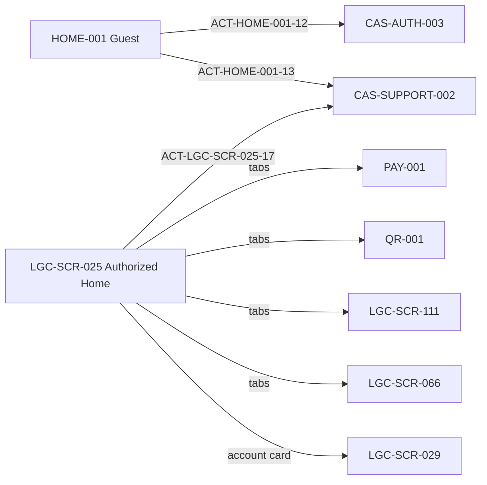
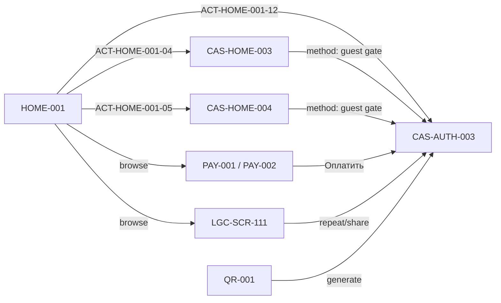
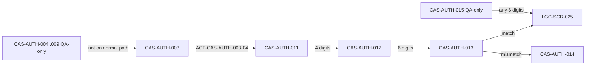
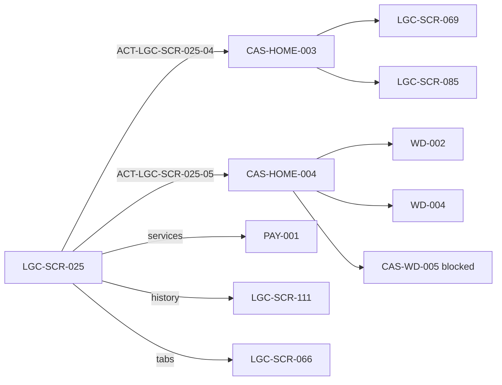
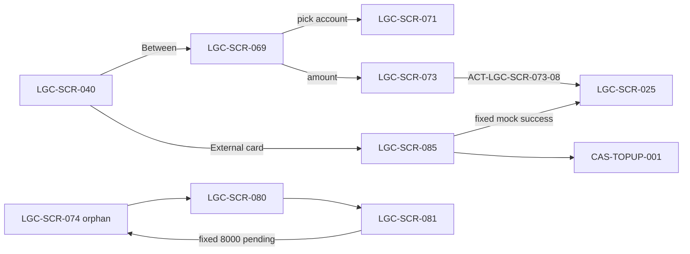
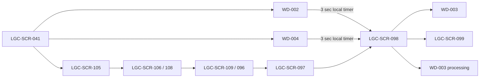
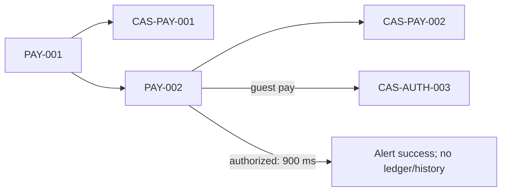
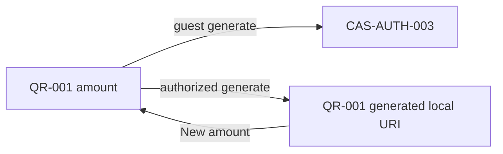
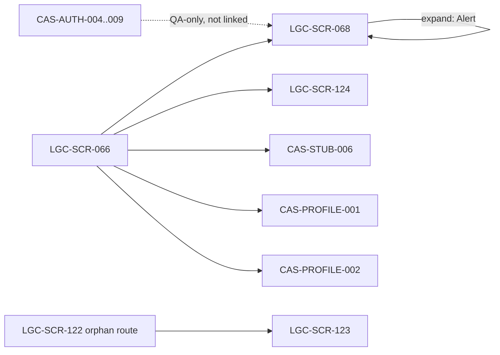
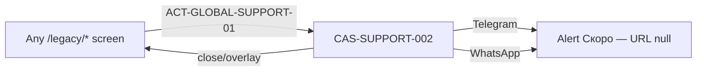

# Current Cashello flow map

These diagrams describe **current routes and runtime behavior**, not approved production rules.

## Guest access matrix

| Surface                 | Visible/browsable to guest | Current click result                           | Screen                 |
| ----------------------- | -------------------------- | ---------------------------------------------- | ---------------------- |
| Guest Home              | YES                        | —                                              | HOME-001               |
| Balances                | YES — zeros                | Demo authorized values                         | HOME-001 / LGC-SCR-025 |
| Top-up sheet            | YES                        | Method click → auth                            | CAS-HOME-003           |
| Withdraw sheet          | YES                        | Method click → auth                            | CAS-HOME-004           |
| Payment catalog         | YES                        | Browse allowed                                 | PAY-001                |
| Payment form            | YES                        | Pay/favorite/account → auth                    | PAY-002                |
| History list            | YES                        | Browse allowed; repeat/share → auth            | LGC-SCR-111            |
| QR                      | YES                        | Amount allowed; generate → auth                | QR-001                 |
| Profile                 | NO                         | Header/tab → auth                              | LGC-SCR-066            |
| Direct money deep links | YES in current code        | No route-level guard                           | topup/**, withdraw/**  |
| Support FAB             | YES                        | Opens sheet; Telegram/WhatsApp → Alert «Скоро» | CAS-SUPPORT-002        |

## Global navigation

## Guest flow

## Authentication

## Authorized Home

## Top-up and own-account transfer

## Withdraw

## Service payment

## QR

## Profile / KYC

## Support FAB

## Error-path classification

- **BUSINESS_DECISION:** money availability, cancellation, expiry, limits, fees, late reversals.
- **TECHNICAL_DECISION:** transport retries, idempotency implementation, webhook deduplication mechanics, observability.
- **BOTH:** timeout/unknown result UX, duplicate submissions, recovery after app close, manual review.
- Shared owner decisions: `Q-ERR-001`, `Q-ERR-002`, `Q-ERR-003`, `Q-ERR-004`, `Q-ERR-005`, `Q-ERR-006`, `Q-ERR-007`, `Q-ERR-008`.

## Post-design Home navigation (5977543)

These are navigation transitions within existing business processes, not new process candidates.

- **BP-AUTH-001** (alternate entry): Guest Home bonus row → Auth (`ACT-HOME-001-14`). PROTOTYPE_UI_ONLY — «+500 Б» copy is not production policy.
- **BP-PAY-001** (alternate entry): Authorized Home recent-operation row → prefilled `PAY-002` (`ACT-LGC-SCR-025-18`…`025-25`, `ACT-LGC-SCR-026-17`…`026-24`, `ACT-PAY-002-15`). CURRENT_MOCK_BEHAVIOR — preview catalog rows, not real transaction history.
- **BP-HIST-001** (unchanged): «См. все» on Home (`ACT-LGC-SCR-025-10`, `ACT-LGC-SCR-026-10`) still routes to history.
- Removed from current product: Home services preview rows, Home history preview rows, Home `HistoryActionSheet` overlay screen record (`CAS-HOME-005`). `HistoryActionSheet` remains on history screens (`CAS-HIST-002`).
